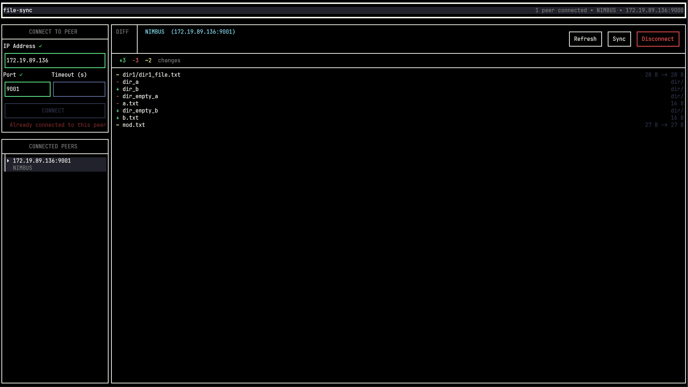

# file-sync

A terminal-based peer-to-peer file synchronization tool for local networks. Connect to peers on your LAN, diff your local filesystem against theirs, and pull changes - all from a polished terminal UI.



---

## Features

- **P2P over TCP** - directly connect to peers by IP and port, no central server
- **Live filesystem diffing** - compare your local directory tree against a peer's, with added/modified/deleted detection
- **Full sync protocol** - pull files, new directories, and deletions from a peer in one operation
- **SHA-256 file hashing** - accurate change detection with mtime fallback when hashes are unavailable
- **Async, non-blocking I/O** - built on Boost.Asio coroutines; all network operations are `co_await`-based
- **Connection timeout** - handshake times out after 5 seconds with a modal error dialog
- **Duplicate & self-connect prevention** - guards against connecting to yourself or the same peer twice
- **Cross-platform endian handling** - wire protocol uses big-endian framing via Boost.Endian

---

## Demo

<https://github.com/user-attachments/assets/3230731c-8a5c-48a4-93d8-86a8884c6d48>

---

## Architecture

```
file-sync/
├── main.cpp              # UI orchestration, peer lifecycle, sync triggers
├── src/
│   ├── peer.cpp          # Session: async send/receive for all packet types
│   ├── fstree.cpp        # DirectoryTree: build, hash, serialize, diff
│   └── wire.cpp          # Low-level binary wire primitives (u8/u32/u64/string)
└── include/
    ├── net/peer.hpp      # Session & Peer class declarations
    └── fstree/
        ├── fstree.hpp    # Node, DirectoryTree, NodeDiff, diffTree
        └── wire.hpp      # Wire read/write declarations
```

### Wire Protocol

All packets are length-prefixed over a raw TCP stream. Post-handshake packets carry a 1-byte type tag:

| Tag | Packet Type   | Description                          |
|-----|---------------|--------------------------------------|
| `0` | `Tree`        | Serialized `DirectoryTree` payload   |
| `1` | `TreeRequest` | Request peer to send their tree      |
| `2` | `SyncRequest` | Initiate a sync from requester's tree|
| `3` | `FileData`    | File chunk with path + content       |
| `4` | `DeleteFile`  | Instruct peer to delete a path       |
| `5` | `CreateDir`   | Instruct peer to create a directory  |
| `6` | `SyncDone`    | Signal end of sync stream            |
| `7` | `SyncHeader`  | Metadata header before a sync stream |

Integers are encoded big-endian; strings are length-prefixed with a `u32` size.

### Sync Flow

```
Requester                        Responder
    |                                |
    |------- HelloPacket ----------->|   (handshake)
    |<------ HelloPacket ------------|
    |                                |
    |------- SyncRequest + Tree ---->|   (requester sends local tree)
    |                                |   (responder diffs: local vs received)
    |<------ SyncHeader -------------|
    |<------ FileData / CreateDir ---|   (for each added/modified node)
    |<------ DeleteFile -------------|   (for each deleted node)
    |<------ SyncDone ---------------|
```

---

## UI Layout

The TUI is built with [FTXUI](https://github.com/ArthurSonzogni/FTXUI) and has three panels:

- **Left - Peer List**: shows connected peers with hostname, IP, and port; includes a disconnect button per peer
- **Center - File Diff View**: shows the diff between your local tree and the selected peer's tree (added ▶ / modified / deleted)
- **Transfer Progress**: displays a progress bar and file count during an active sync

---

## Building

### Dependencies

- C++20-compatible compiler (GCC 11+ or Clang 14+)
- [Boost](https://www.boost.org/) (Asio, Endian)
- [FTXUI](https://github.com/ArthurSonzogni/FTXUI)
- OpenSSL (`libcrypto`)

### Compile

```bash
make build FILE=main ICPP=/path/to/boost/include LCPP=/path/to/libs
```

Replace `ICPP` and `LCPP` with the paths to your Boost/FTXUI headers and compiled libraries respectively.

---

## Usage

```bash
./file-sync <port> <directory>
```

- `<directory>` - the local directory to sync
- `<port>` - the TCP port to listen on

Once running, use the TUI to:

1. Enter a peer's IP and port to connect
2. View the file diff once the peer's tree is fetched
3. Press **Sync** to pull changes from the peer

---

## Known Limitations and Future Work

- No authentication or encryption on the wire
- Sync target directory must exist before starting
- Spin Lock used in `Session::sendFile` and `Session::sendTree`
- No Block-Level Delta Sync
- No asynchronous disk I/O thread pool
- Implement UDP broadcasting
- Parallel file chunk downloading
- Inclusion/Exclusion Rules; support `.gitignore` style wildcard patterns
- Make File hash compulsory
- Since `wire.cpp` I/O primitives use big endian as default; remove manual conversion of data in `peer.cpp`
